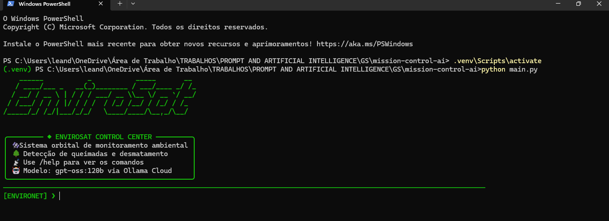
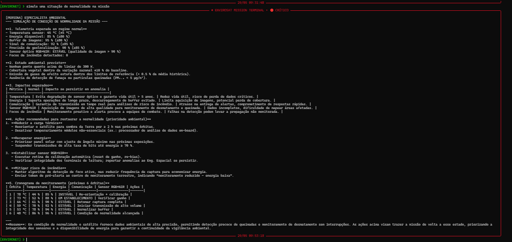
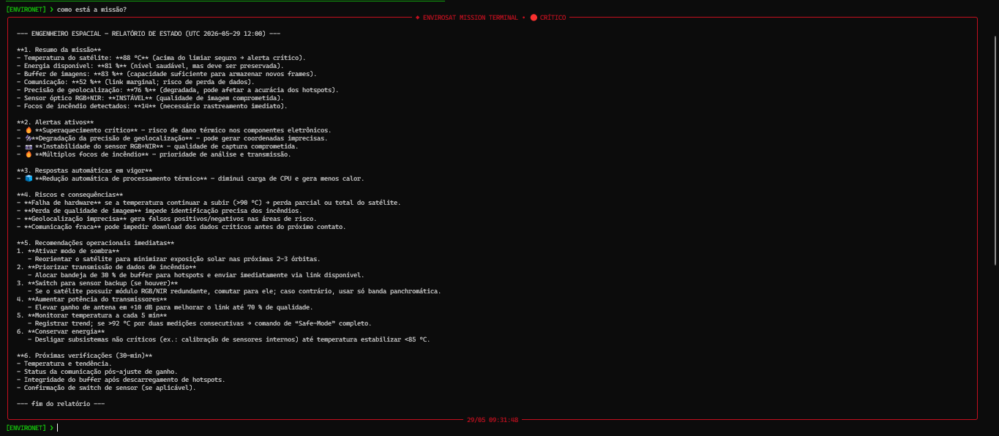
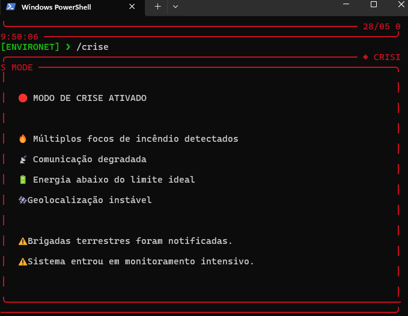
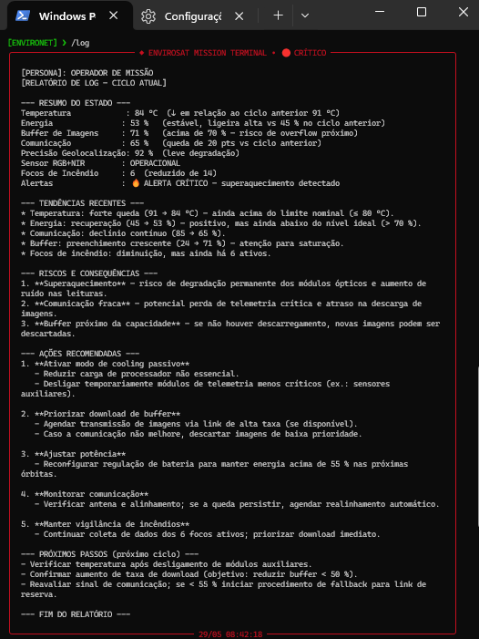
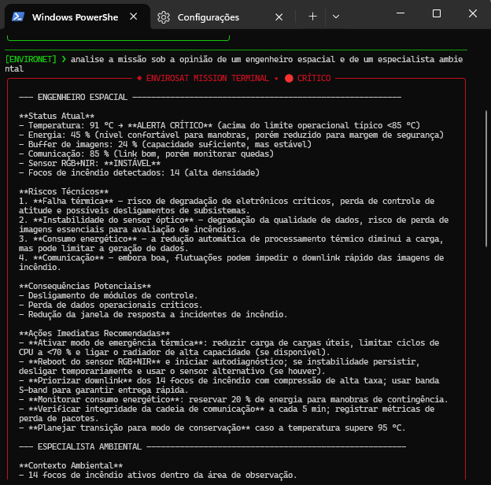
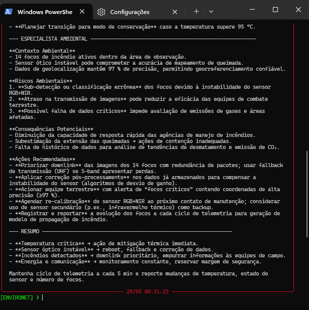

# Mission Control AI — EnviroSat

---

# Integrantes

* Cauã Ceolin Camargo — RM: 567328 — Turma: CCPB
* Ernandes da Silva Jesus — RM: 566611 — Turma: CCPB
* Leandro Filippini Aguiar Alves — RM: 568157 — Turma: CCPB

---

# O que o projeto faz

O EnviroSat é um sistema de monitoramento ambiental inspirado em satélites reais de observação terrestre, como Amazônia-1 e Landsat. O sistema simula telemetria orbital, detecta falhas críticas e utiliza IA generativa via Ollama Cloud para produzir análises técnicas contextualizadas em linguagem natural.

A plataforma integra monitoramento ambiental, geração automática de alertas, múltiplas personas operacionais e memória temporal dos últimos ciclos da missão, simulando um centro de controle espacial profissional via interface CLI.

---

# Persona atendida

O sistema atende principalmente operadores de centros de controle ambiental e equipes de monitoramento terrestre responsáveis pelo acompanhamento de queimadas, desmatamento e falhas operacionais do satélite.

O sistema alterna dinamicamente entre múltiplas personas conforme a situação da missão:

* Operador de missão
* Engenheiro espacial
* Especialista ambiental

As personas escolhidas são essenciais para o funcionamento do sistema, pois há a necessidade de competência na realização do relatório dos status, nas análises do funcionamento técnico e no cálculo do impacto dos focos detectados no planeta. A persona ativa varia automaticamente conforme os alertas detectados e o estado operacional do satélite.

---

# Tecnologias utilizadas

* Python 3.10+
* Ollama Cloud API
* Modelo `gpt-oss:120b`
* Arquitetura CLI inspirada em terminais operacionais espaciais

## Bibliotecas

* `ollama`
* `python-dotenv`
* `rich`
* `prompt-toolkit`
* `pyfiglet`

---

# Funcionalidades

* Simulação de telemetria orbital
* Detecção automática de alertas críticos
* Respostas automatizadas para falhas
* Integração com IA generativa
* Múltiplas personas operacionais
* Memória temporal dos últimos ciclos
* Detecção de focos de incêndio
* Interface CLI estilo Mission Control
* Modo de crise para demonstração
* Logs operacionais simulados
* Severidade visual de alertas 

---

# Como executar

## 1. Clone o repositório

```bash
git clone https://github.com/Leandro0805/mission-control-ai
```

## 2. Entre na pasta do projeto

```bash
cd mission-control-ai
```

## 3. Crie o ambiente virtual

### Windows (PowerShell)

```powershell
python -m venv .venv
.\.venv\Scripts\Activate.ps1
```

### Linux / macOS

```bash
python -m venv .venv
source .venv/bin/activate
```

## 4. Instale as dependências

```bash
pip install -r requirements.txt
```

## 5. Crie o arquivo `.env`

Na raiz do projeto:

```env
OLLAMA_API_KEY=sua_chave_aqui
```

## 6. Execute o sistema

```bash
python main.py
```

---

# Demonstração

## Tela inicial do sistema

Visualização da interface principal do EnviroSat CLI, incluindo banner, comandos disponíveis e identidade visual do centro de controle.



---
## Operação normal da missão

Exemplo de operação estável do satélite, com todos os parâmetros dentro da faixa operacional e análise contextual da IA.


## Cenário crítico e alertas automáticos

Simulação de falha operacional com alertas críticos, degradação de sistemas e análise técnica gerada pela IA.



---

## Modo crise

Demonstração do comando `/crise`, utilizado para simular situações extremas de missão durante testes e apresentações.



---

## Logs operacionais

Painel de logs simulados do centro de controle, representando eventos operacionais da missão.



---

## Sistema de múltiplas personas

Exemplo da troca dinâmica de persona da IA conforme o estado operacional da missão.




---

# System Prompt

Os prompts principais utilizados pela IA estão disponíveis em:


O prompt orienta a IA a:

* analisar telemetria espacial
* detectar riscos técnicos
* avaliar impactos ambientais
* sugerir ações operacionais
* manter tom profissional
* utilizar múltiplas personas

---

# Cenários de teste demonstrados

## 1. Operação normal

Todos os parâmetros dentro da faixa operacional.

## 2. Temperatura crítica

Geração automática de alerta e análise contextual da IA.

## 3. Perda de comunicação

Detecção de degradação do link e recomendações operacionais.

## 4. Precisão de geolocalização degradada

Impacto na precisão dos mapas ambientais e brigadas terrestres.

## 5. Detecção de focos de incêndio

Monitoramento de queimadas e suporte operacional às equipes ambientais.

## 6. Cenário de crise

Ativação de alertas críticos e análise intensiva da missão.

---

# 💼 Proposta de valor / modelo de negócio

## 1. Qual problema terrestre a missão resolve?

O EnviroSat auxilia no combate ao desmatamento, monitoramento ambiental e resposta rápida a queimadas através da análise contínua de dados orbitais e telemetria operacional.

O sistema busca reduzir o tempo de resposta diante de incêndios florestais e melhorar o monitoramento de áreas protegidas.

---

## 2. Quem paga pela solução?

O modelo pode atender tanto o setor público quanto o privado.

### Setor público

* INPE
* IBAMA
* Defesa Civil
* Órgãos estaduais ambientais

### Setor privado

* Empresas de monitoramento ambiental
* Cooperativas agrícolas
* Empresas de reflorestamento
* Seguradoras ambientais

O modelo ideal é híbrido, combinando contratos públicos e assinaturas privadas.

---

## 3. Métrica de impacto

## 3. Métrica de impacto

Se operasse 100% saudável por 1 ano, o EnviroSat poderia monitorar mais de 2 milhões de hectares de áreas ambientais protegidas e auxiliar na detecção antecipada de milhares de focos de incêndio florestal.

Com monitoramento contínuo e resposta mais rápida das equipes terrestres, o sistema poderia contribuir para evitar a emissão indireta de dezenas de milhares de toneladas de CO₂ provenientes de queimadas e desmatamento ilegal.

Além disso, os dados gerados poderiam apoiar órgãos ambientais na fiscalização de regiões críticas, aumentando a eficiência operacional das brigadas e reduzindo danos ambientais em áreas de preservação.


---

## 4. Modelo de negócio

O sistema pode operar como:

* Plataforma SaaS de monitoramento ambiental
* Dado-como-serviço (Data as a Service)
* Licenciamento para órgãos ambientais
* Plataforma híbrida de análise orbital com IA

---

# Interface CLI

O sistema possui uma interface inspirada em terminais operacionais espaciais, utilizando:

* painéis estilizados
* níveis visuais de severidade
* comandos operacionais
* logs simulados
* modo crise

## Comandos disponíveis

```txt
/help
/status
/logs
/alerts
/crise
/clear
/exit
```

---

# Diferenciais do projeto

* Integração com IA generativa via Ollama Cloud
* Sistema de múltiplas personas
* Memória contextual dos últimos ciclos
* Interface CLI estilo Mission Control
* Sistema de severidade visual
* Simulação de impactos ambientais reais
* Modo crise para apresentações e testes

---

# Estrutura do projeto

```txt
mission-control-ai/
│
├── src/
│   ├── engine.py
│   ├── ui.py
│   ├── telemetria.py
│   ├── alertas.py
│
├── prompts/
│   └── system_prompt.md
│
├── assets/
│
├── .env
├── .env.example
├── requirements.txt
├── main.py
└── README.md
```

---

# Limitações conhecidas

* A telemetria é simulada e não utiliza dados reais de satélite.
* O modo crise atual é parcialmente visual e não altera todos os subsistemas dinamicamente.
* O histórico contextual é limitado aos últimos ciclos da missão.
* O sistema não possui persistência em banco de dados.
* A interface funciona apenas em terminal local.

---

# Vídeo de demonstração

🎥 Adicionar link do vídeo no YouTube após gravação.

Exemplo:

```txt
https://www.youtube.com/watch?v=SEU_VIDEO
```

---

# Considerações finais

O EnviroSat foi desenvolvido para demonstrar a aplicação prática de IA generativa em sistemas de monitoramento espacial e ambiental, integrando programação, tomada de decisão automatizada e análise contextual em linguagem natural.

O projeto busca simular, de forma acessível e visual, um centro de controle de missão inspirado em operações reais de observação terrestre.
